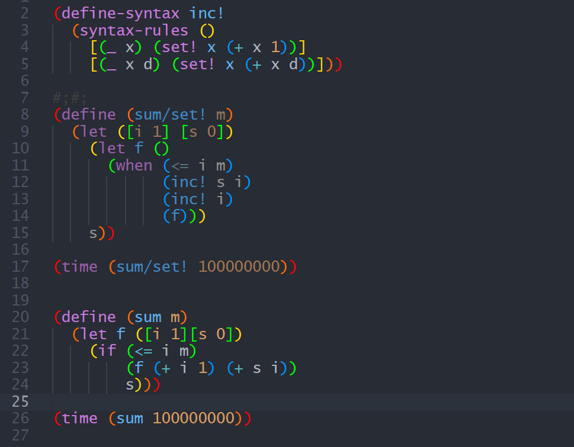
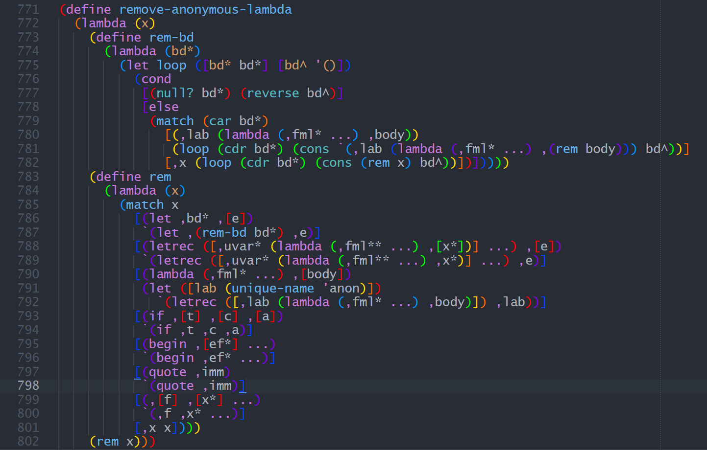
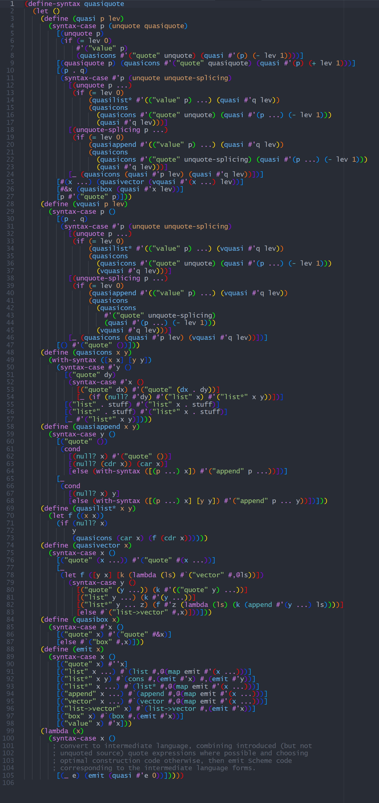
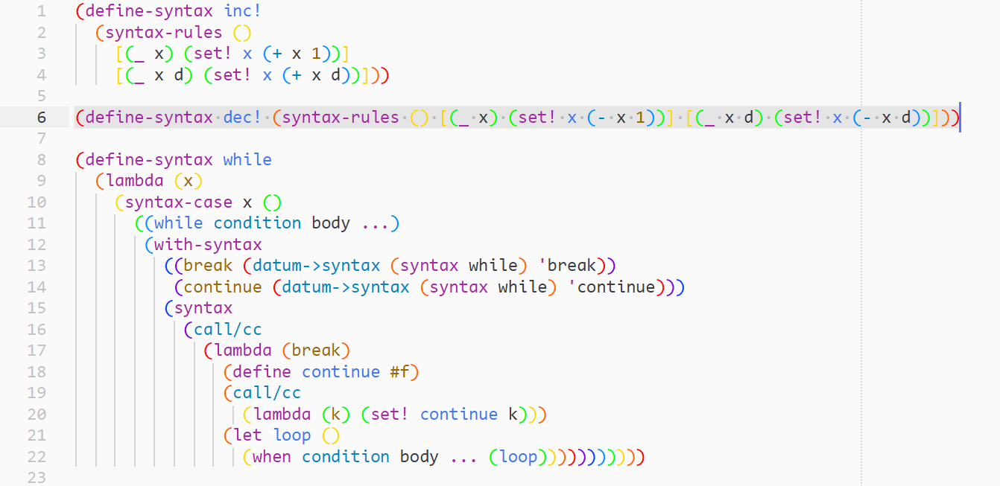
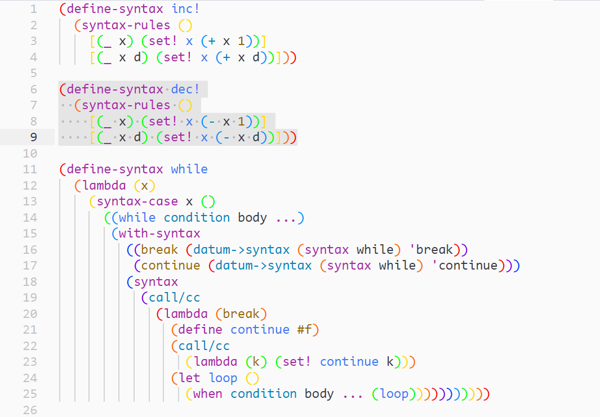

# Scheme
[Repository URL](https://github.com/absop/Scheme)

Scheme syntax highlighting and code formatter for Sublime Text 4.


## Screenshots







## Usage
### Syntax Highlighting

To distinguish expression commented regions from normal regions, exec the command `UI: Customize Color Scheme`, and merge the following code into your customized color scheme.

```json
{
    "rules":
    [
        {
          "scope": "meta.comment",
          "foreground_adjust": "l(- 15%) s(- 30%)",
          "background": "var(--background)"
        }
    ]
}
```

### Code Formatting

#### Key bindings
|           key           | Command            | Context       |
| :---------------------: | ------------------ | ------------- |
| <kbd> ctrl+alt+f </kbd> | Format Scheme Code | source.scheme |

#### Before Formatting


#### After Formatting


#### How to Use
Select a region of code (with some expressions in it), and then press down the shortcuts (<kbd> ctrl+alt+f </kbd>).


### Code Editing

In order to get a better Scheme code editor experience, you will need to install another plugin: [RainbowBrackets](https://github.com/absop/RainbowBrackets), it gives you rainbow brackets and the ability to quickly edit brackets.
